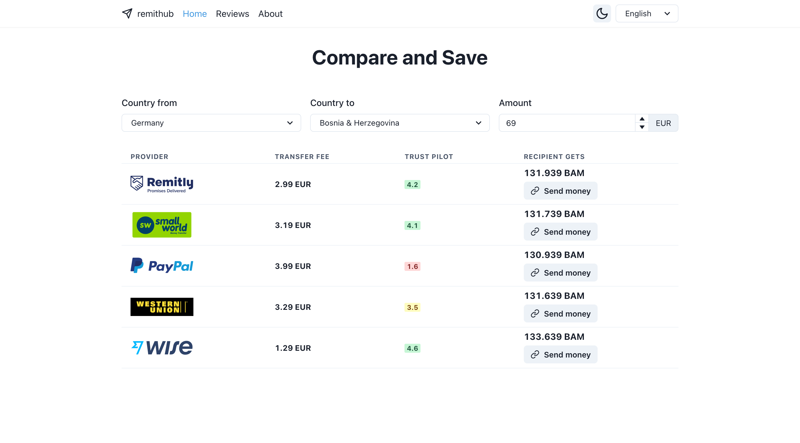

<div align="center">

[](https://github.com/facebook/jest)
[](https://cypress.io)
[](https://github.com/prettier/prettier)
[](https://github.com/malcodeman/remithub/blob/master/LICENSE)

</div>
<br />
<div align="center"><h2>remithub</h2></div>
<div align="center">Save on money transfer fees, obtain the best exchange rates by finding the best money transfer provider.</div>
<br />
<div align="center">
  <sub>Coded by <a href="https://malcodeman.com">malcodeman</a> 👨‍🚀</sub>
</div>
<br />



## Getting started

```
git clone https://github.com/malcodeman/remithub.git
cd remithub
yarn install
yarn dev
```

.env.local:

```
FIXER_ACCESS_KEY=key
```

## License

[MIT](./LICENSE)
